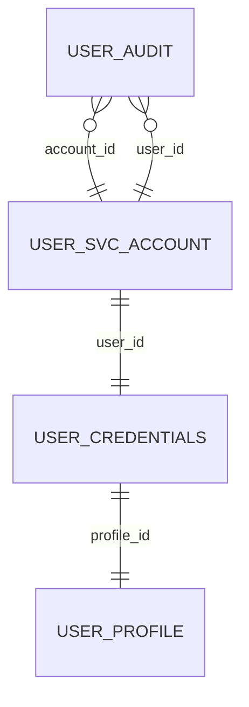

# IAM Server - Web MVC


## Entity Diagram


```mermaid
erDiagram
    USER_CREDENTIALS ||--|| USER_PROFILE : profile_id
    USER_SVC_ACCOUNT ||--|| USER_CREDENTIALS  : user_id

    USER_AUDIT }o--|| USER_SVC_ACCOUNT :  account_id
    USER_AUDIT }o--|| USER_SVC_ACCOUNT : user_id


```

## Test

```bash
$ curl http://localhost:8080/user/auth?userId=fleadley0&password=5f4dcc3b5aa765d61d8327deb882cf99 --silent
```
